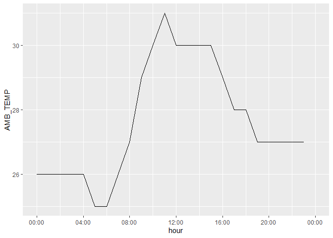
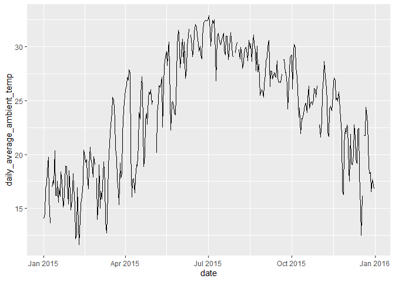
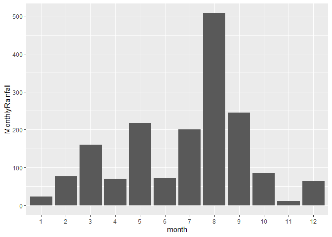
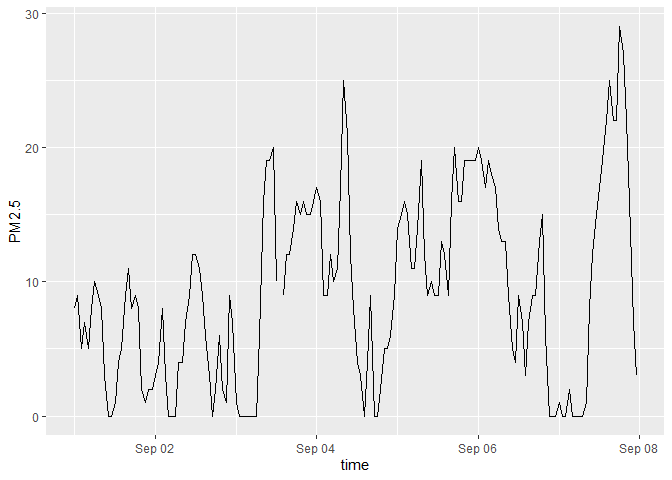

# NTRES 6100: Assignment \#6
Lok Mani Sapkota

## Loading all the required packages

``` r
library(tidyverse)
library(knitr)
library(lubridate)
```

## **Exercise 1. Tibble and Data Import**

Import the data frames listed below into R and
[parse](https://r4ds.had.co.nz/data-import.html#parsing-a-vector) the
columns appropriately when needed. Watch out for the formatting oddities
of each dataset. Print the results directly, **without** using
`kable()`.

**You only need to finish any three out of the five questions in this
exercise in order to get credit.**

#### **1.1 Create the following tibble manually, first using `tribble()` and then using `tibble()`. Print both results. \[We didn’t have time to cover this in class, but look up how these functions work [here](https://r4ds.had.co.nz/tibbles.html#creating-tibbles)\]**

`tribble()`:

``` r
tribble(
  ~a, ~b, ~c,
  1, 2.1, "apple",
  2, 3.2, "orange"
  )
```

    # A tibble: 2 × 3
          a     b c     
      <dbl> <dbl> <chr> 
    1     1   2.1 apple 
    2     2   3.2 orange

`tibble()`:

``` r
tibble(
  a = c(1, 2),
  b = c(2.1, 3.2),
  c = c("apple", "orange")
)
```

    # A tibble: 2 × 3
          a     b c     
      <dbl> <dbl> <chr> 
    1     1   2.1 apple 
    2     2   3.2 orange

#### **1.2 Import `https://raw.githubusercontent.com/nt246/NTRES-6100-data-science/master/datasets/dataset2.txt` into R. Change the column names into “Name”, “Weight”, “Price”.**

``` r
df2 <- read.table(
  "https://raw.githubusercontent.com/nt246/NTRES-6100-data-science/master/datasets/dataset2.txt",
  sep = ",",
  col.names = c("Name", "Weight", "Price"),
  header = FALSE
)

df2$Weight <-  as.double(df2$Weight)

df2
```

        Name Weight Price
    1  apple      1   2.9
    2 orange      2   4.9
    3 durian     10  19.9

#### **1.3 Import `https://raw.githubusercontent.com/nt246/NTRES-6100-data-science/master/datasets/dataset3.txt` into R. Watch out for the first few lines, missing values, separators, quotation marks, and deliminaters.**

``` r
df3 <- read_delim("https://raw.githubusercontent.com/nt246/NTRES-6100-data-science/master/datasets/dataset3.txt", 
                  delim = ";",
                  skip = 2,
                  quote = "/",
                  na = c("?", "Not Available"), 
                  trim_ws = TRUE
                )
df3
```

    # A tibble: 3 × 3
      Name   Weight Price
      <chr>   <dbl> <dbl>
    1 apple       1   2.9
    2 orange      2  NA  
    3 durian     NA  19.9

#### **1.4 Import `https://raw.githubusercontent.com/nt246/NTRES-6100-data-science/master/datasets/dataset4.txt` into R. Watch out for comments, units, and decimal marks (which are `,` in this case).**

``` r
df4 <- read_delim("https://raw.githubusercontent.com/nt246/NTRES-6100-data-science/master/datasets/dataset4.txt", comment = "/")
df4 <- df4 |>
  mutate(
    Weight = parse_number(Weight),
    Price = Price |>
      str_replace_all(",", ".") |>
      str_remove_all("€") |>
      as.numeric()
  )
df4
```

    # A tibble: 3 × 3
      Name   Weight Price
      <chr>   <dbl> <dbl>
    1 apple       1   2.9
    2 orange      2   4.9
    3 durian     10  19.9

## **Exercise 2. Weather station**

This dataset contains the weather and air quality data collected by a
weather station in Taiwan. It was obtained from the Environmental
Protection Administration, Executive Yuan, R.O.C. (Taiwan).

#### **2.1 Variable descriptions**

- The text file
  `https://raw.githubusercontent.com/nt246/NTRES-6100-data-science/master/datasets/2015y_Weather_Station_notes.txt`
  contains descriptions of different variables collected by the station.

- Import it into R and print it in a table as shown below with
  `kable()`.

``` r
weather_notes <- read_delim(
  "https://raw.githubusercontent.com/nt246/NTRES-6100-data-science/master/datasets/2015y_Weather_Station_notes.txt",
  delim = "-",
  col_names = TRUE,
  trim_ws = TRUE,
  locale = locale(encoding = "UTF-8")
)
kable(weather_notes)
```

| Item | Unit | Description |
|:---|:---|:---|
| AMB_TEMP | Celsius | Ambient air temperature |
| CO | ppm | Carbon monoxide |
| NO | ppb | Nitric oxide |
| NO2 | ppb | Nitrogen dioxide |
| NOx | ppb | Nitrogen oxides |
| O3 | ppb | Ozone |
| PM10 | μg/m3 | Particulate matter with a diameter between 2.5 and 10 μm |
| PM2.5 | μg/m3 | Particulate matter with a diameter of 2.5 μm or less |
| RAINFALL | mm | Rainfall |
| RH | % | Relative humidity |
| SO2 | ppb | Sulfur dioxide |
| WD_HR | degress | Wind direction (The average of hour) |
| WIND_DIREC | degress | Wind direction (The average of last ten minutes per hour) |
| WIND_SPEED | m/sec | Wind speed (The average of last ten minutes per hour) |
| WS_HR | m/sec | Wind speed (The average of hour) |

`#` indicates invalid value by equipment inspection  
`*` indicates invalid value by program inspection  
`x` indicates invalid value by human inspection  
`NR` indicates no rainfall  
blank indicates no data

#### **2.2 Data tidying**

- Import
  `https://raw.githubusercontent.com/nt246/NTRES-6100-data-science/master/datasets/2015y_Weather_Station.csv`
  into R. As you can see, this dataset is a classic example of untidy
  data: values of a variable (i.e. hour of the day) are stored as column
  names; variable names are stored in the `item` column.

- Clean this dataset up and restructure it into a tidy format.

- Parse the `date` variable into date format and parse `hour` into time.

- Turn all invalid values into `NA` and turn `NR` in rainfall into `0`.

- Parse all values into numbers.

- Show the first 6 rows and 10 columns of this cleaned dataset, as shown
  below, *without* using `kable()`.

Before cleaning:

``` r
weather_data <- read.csv("https://raw.githubusercontent.com/nt246/NTRES-6100-data-science/master/datasets/2015y_Weather_Station.csv",
             sep = ",",
             header = TRUE,
             check.names = FALSE)
head(weather_data,6)
```

            date station     item   00  01   02   03   04   05   06  07   08   09
    1 2015/01/01 Cailiao AMB_TEMP   16  16   15   15   15   14   14  14   14   15
    2 2015/01/01 Cailiao       CO 0.74 0.7 0.66 0.61 0.51 0.51 0.51 0.6 0.62 0.58
    3 2015/01/01 Cailiao       NO    1 0.8  1.1  1.7    2  1.7  1.9 2.4  3.4  3.7
    4 2015/01/01 Cailiao      NO2   15  13   13   12   11   13   13  16   16   14
    5 2015/01/01 Cailiao      NOx   16  14   14   13   13   15   15  18   19   18
    6 2015/01/01 Cailiao       O3   35  36   35   34   34   32   30  26   26   29
        10   11   12  13  14   15   16   17   18   19   20  21   22   23
    1   14   15   15  15  14   13   13   13   12   13   13  13   13   13
    2 0.53 0.49 0.45 0.4 0.4 0.41 0.44 0.45 0.41 0.42 0.31 0.3 0.32 0.33
    3  3.5  3.4  3.3 3.1 3.2  2.5  2.9  2.2  2.3  2.3  1.8 1.9  2.1  1.8
    4   12   11   11 9.8  11   11   14   15   16   18   13  13   14   16
    5   15   15   14  13  14   14   17   17   18   20   15  15   16   17
    6   33   38   38  40  39   35   31   30   30   27   30  28   27   25

After cleaning:

``` r
weather_clean <- weather_data |> 
  pivot_longer(
    cols = matches("^\\d{2}$"),        
    names_to  = "hour",
    values_to = "value"
  ) |> 
  mutate(
    date = str_replace_all(date, "/", "-") |> 
      as.Date(),
    hour = paste0(str_pad(hour, 2, pad = "0"), ":00"),
    value = case_when(
      value %in% c("#", "*", "X") ~ NA_character_,
      value == "NR" ~ "0",
      TRUE ~ value
    ),
    value = parse_number(value)
  ) |> 
  pivot_wider(
    names_from  = item,
    values_from = value
  ) |> 
  arrange(date, station, hour)

head(weather_clean,6)
```

    # A tibble: 6 × 18
      date       station hour  AMB_TEMP    CO    NO   NO2   NOx    O3  PM10 PM2.5
      <date>     <chr>   <chr>    <dbl> <dbl> <dbl> <dbl> <dbl> <dbl> <dbl> <dbl>
    1 2015-01-01 Cailiao 00:00       16  0.74   1      15    16    35   171    76
    2 2015-01-01 Cailiao 01:00       16  0.7    0.8    13    14    36   174    78
    3 2015-01-01 Cailiao 02:00       15  0.66   1.1    13    14    35   160    69
    4 2015-01-01 Cailiao 03:00       15  0.61   1.7    12    13    34   142    60
    5 2015-01-01 Cailiao 04:00       15  0.51   2      11    13    34   123    52
    6 2015-01-01 Cailiao 05:00       14  0.51   1.7    13    15    32   110    44
    # ℹ 7 more variables: RAINFALL <dbl>, RH <dbl>, SO2 <dbl>, WD_HR <dbl>,
    #   WIND_DIREC <dbl>, WIND_SPEED <dbl>, WS_HR <dbl>

#### **2.3 Using this cleaned dataset, plot the daily variation in ambient temperature on September 25, 2015, as shown below.**

``` r
weather_clean  |> 
  filter(date == as.Date("2015-09-25"))  |> 
  mutate(hour = hm(hour))  |>                
  arrange(hour) |> 
  ggplot(aes(x = hour, y = AMB_TEMP)) +
  geom_line() +
  scale_x_time(
    breaks = hm(sprintf("%02d:00", seq(0, 24, by = 4))),   
    limits = c(hm("00:00"), hm("24:00")),
    labels = scales::time_format("%H:%M"))
```



#### **2.4 Plot the daily average ambient temperature throughout the year with a continuous line, as shown below.**

``` r
weather_clean |> 
  group_by(date) |> 
  summarise(daily_average_ambient_temp = mean(AMB_TEMP)) |> 
   ggplot(aes(x = date, y = daily_average_ambient_temp)) +
  geom_line() 
```



#### **2.5 Plot the total rainfall per month in a bar chart, as shown below.**

Hint: separating date into three columns might be helpful.

``` r
weather_clean |> 
  mutate(month = month(date)) |> 
  group_by(month) |> 
  summarize(MonthlyRainfall = sum(RAINFALL, na.rm = TRUE)) |> 
   ggplot(aes(x = factor(month), y = MonthlyRainfall)) +
  geom_col() +
  labs(
    x = "month",
    y = "MonthlyRainfall"
  )
```



#### **2.6 Plot the per hour variation in PM2.5 in the first week of September with a continuous line, as shown below.**

*Hint: uniting the date and hour and parsing the new variable might be
helpful.*

``` r
weather_clean |> 
  filter(between(date, as.Date("2015-09-01"), as.Date("2015-09-07"))) |> 
  mutate(
    datetime = ymd_hms(paste(date, paste0(hour, ":00")), tz = "UTC")
  ) |> 
  ggplot(aes(x = datetime, y = `PM2.5`)) +
  geom_line() +
  labs(
    x = "time",
    y = "PM2.5"
    )
```


